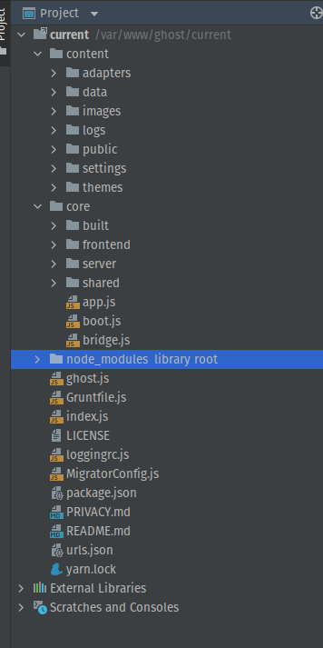

# ghost-pruebas-g42

##  Sistema de registro de incidencias

Estas se encuentran en el modulo Issus de este proyecteco. donde se encuentras los 10 errores encontrados 

## Código fuente

se observa por cada carpeta archivos tipo .js y .css tambien se tiene la esctructuras de carpetas

se observa se tiene un core donde se aloja el server el fronted y un constructor  se observa que tiene un patron de diseno built y con respecto a la arquitectura se observa que 

foto de arquitectura tomada de https://ghost.org/docs/architecture/

## lista de funcionalidades

| **Funcionalidad** |      **Titulo**     | **Descripción**                                                                                                                                                                                                                                                      |
|:--------------------:|:----------------------:|-----------------------------------------------------------------------------------------------------------------------------------------------------------------------------------------------------------------------------------------------------------------------|
|        FU-001        |       Dashboard        | En el módulo administrador, se tiene un cuadro de mando que permite visualizar una gráfica, con miembros, miembros pagos, % apertura de  correos y accesos rápidos para ir a opciones como crear miembro, post, personalizar sitio, etc.                              |
|        FU-002        |       View Site        | En el módulo administrador se puede visualizar el sitio dentro.                                                                                                                                                                                                       |
|        FU-003        |       Crear Post       | En el módulo administrador, dentro de la opción “Posts”, la opción “New post”, permite crear una entrada para una página del sitio: imagen, titulo y contenido del post.                                                                                              |
|        FU-004        |      Listar Post       | En el módulo administrador, dentro de la opción “Posts”, se pueden observar todos los posts creados, con diferentes filtros de búsqueda.                                                                                                                              |
|        FU-005        |      Editar Post       | En el módulo administrador, dentro de la opción “Posts”, se puede seleccionar un post creado y editar cualquier de sus campos.                                                                                                                                        |
|        FU-006        |     Eliminar Post      | En el módulo administrador, y después de seleccionar un post y abrir la configuración del post (icono parte superior derecha) puede eliminar un post, con lo cual ya no se mostrará en el sitio ni desde el módulo administrador.                                     |
|        FU-007        |      Crear Pages       | En el módulo administrador, con la opción “New page” dentro de la opción “Pages” se puede crear una página, para lo cual se puede ingresar una foto un titulo y/o un contenido                                                                                        |
|        FU-008        |      Listar Pages      | En el módulo administrador, dentro de la opción “Pages”, se listan todas la paginas del sitio.                                                                                                                                                                        |
|        FU-009        |      Editar Pages      | En el módulo administrador, dentro de la opción “Pages”, al seleccionar una pagina se permite editar cualquier parte de su contenido.                                                                                                                                 |
|        FU-010        |     Eliminar Pages     | En el módulo administrador, dentro de la opción “Pages”, al seleccionar una pagina y abrir la configuración de la página(icono parte superior derecha) puede eliminar la misma, con lo cual ya no se podrá acceder en el sitio ni desde el módulo administrador.      |
|        FU-011        |       Crear Tags       | En el módulo administrador, dentro de la opción “Tags”, la opción “New tag”, permite crear una etiqueta, la cual podrá ser asignada a página y/o post.                                                                                                                |
|        FU-012        |      Listar Tags       | En el módulo administrador, dentro de la opción “Tags”, se pueden observar todas las etiquetas creadas, con diferentes filtros de búsqueda.                                                                                                                           |
|        FU-013        |      Editar Tags       | En el módulo administrador, dentro de la opción “Tags”, se puede seleccionar una de las etiquetas listadas y editar cualquier de sus atributos                                                                                                                        |
|        FU-014        |     Eliminar Tags      | En el módulo administrador, y después de seleccionar una Tag, al final del formulario puede eliminar el mismo, con lo que ya no se mostrara en las paginas y/o post asignados, además de desaparecer del listado de tags                                              |
|        FU-015        | Configuración general  | En el módulo administrador, en la configuración, opción “General” se puede modificar los detalles básicos de la publicación (titulo, descripción, zona horaria, etc.) y sus metadatos (motores de búsqueda, y personalizar estructura en tarjeta de redes sociales.)  |
|        FU-016        |    Configura diseño    | En el módulo administrador, en la configuración, opción “Design”, permite personalizar y administrar los temas del sitio                                                                                                                                              |
|        FU-017        | Configurar navegación  | En el módulo administrador, en la configuración, opción “Navigation”, configurar el menú navegación principal y secundaria, agregando, modificando, eliminando paginas                                                                                                |
|        FU-018        |      Tema oscuro       | En el módulo administrador, en la parte inferior izquierda, permite activar el modo oscuro de la consola de administración.                                                                                                                                           |
|        FU-019        |      Suscribirse       | Dentro del Site se permite a los usuarios suscribirse, para lo cual se deben registrar, y así se les enviara newsletter cuando se realice cualquier puplicación                                                                                                       |
